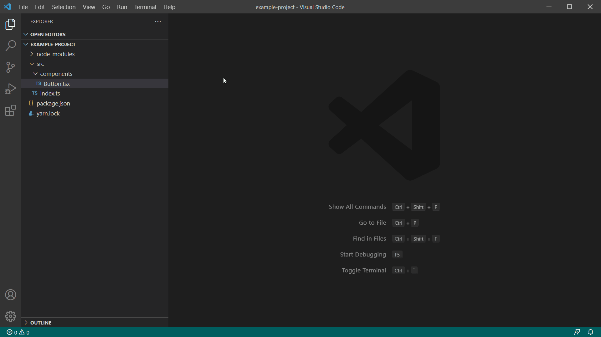

# Testely README

This extension wants to increase the productivity while writing tests for your project. Unit tests are often small and most of the time is wasted with boilerplate code like `import { render } from '@testing/library-react'` and all these little things.

## Showcase

## Features

Currently working on the support for:

- typescript
- typescriptreact

This extension will probably only work for this context at the moment.

### Create Test

The extension will allow you to create a test for the supported language types.

You can create a test with:

- command pallete
- editor title icon (create test)
- explorer context menu
- keybind `Ctrl`+`Shift`+`J` inside of an editor

If the tests already exists, it will open the existing test instead.

### TODO

- Options: open test after creation
- get workspace context, react, testing lib, etc. and start creating content for tests
- global error try catch, catch on root and only use errors inside the rest of the application, reduce vscode import dependency

---

\!\[feature X\]\(images/feature-x.png\)

> Tip: Many popular extensions utilize animations. This is an excellent way to show off your extension! We recommend short, focused animations that are easy to follow.

## Extension Settings

Include if your extension adds any VS Code settings through the `contributes.configuration` extension point.

For example:

This extension contributes the following settings:

- `testely.testLocation`: sets the folder where you want the test files to be created.
- `testely.testDirectoryName`: the name of the drectory, is used for `same directory (nested)` of `testely.testLocatiopn`.

## Known Issues

Calling out known issues can help limit users opening duplicate issues against your extension.

## Release Notes

Release notes are inside the [CHANGELOG](./CHANGELOG.md).

## Following extension guidelines

Ensure that you've read through the extensions guidelines and follow the best practices for creating your extension.

- [Extension Guidelines](https://code.visualstudio.com/api/references/extension-guidelines)

### Dev Ressources

- https://code.visualstudio.com/api/references/when-clause-contexts
- Release Setup https://dev.to/shaimendel/vs-code-extension-building-auto-ci-cd-with-github-actions-2dmf
